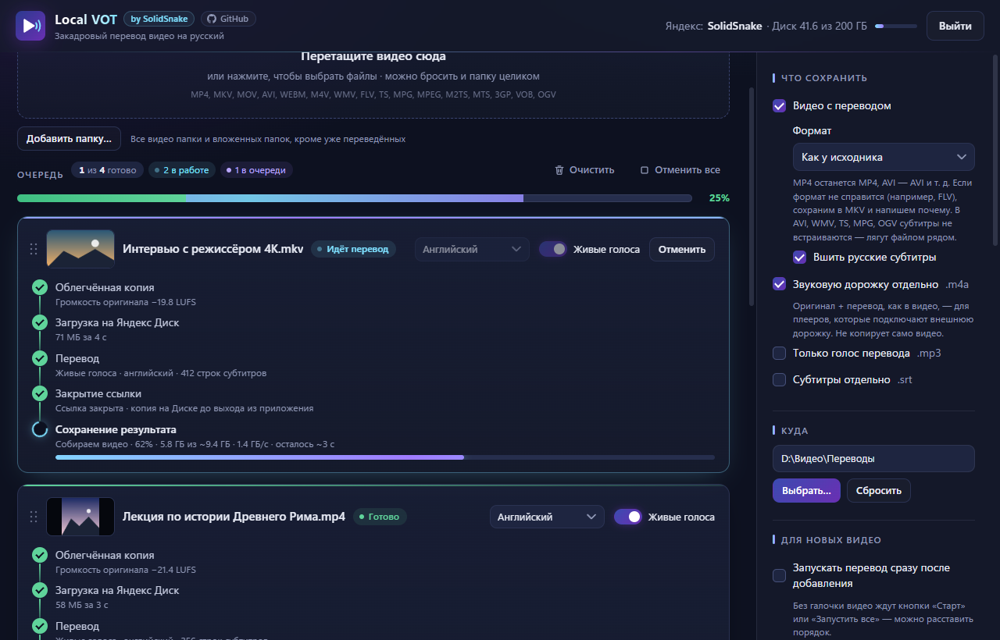
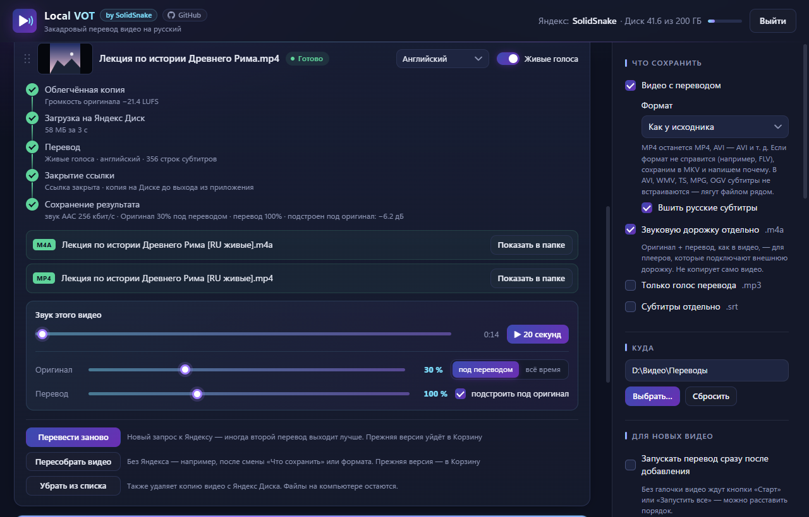

<p align="center">
  
</p>

<h1 align="center">Local VOT</h1>

<p align="center">
  <a href="README.en.md"></a>
  <a href="README.md"></a>
  
</p>

<p align="center">
  Russian voice-over for your own video files, made by Yandex's video translation — like in Yandex Browser,
  but for videos on your computer.
</p>

<p align="center">
  <a href="https://github.com/SolidSnake1765/local-vot/releases/latest"><b>⬇ Download for Windows</b></a>
</p>

<p align="center">
  
</p>

## What it is

Yandex has great video voice-over translation, but it only works in the browser and only for online videos.
**Local VOT** translates videos stored on your computer. The translation is always **into Russian**, and the app's interface is in Russian too.

It is built on two open-source libraries: [vot.js](https://github.com/FOSWLY/vot.js) talks to the Yandex
translator, [ffmpeg](https://ffmpeg.org) handles audio and video. The idea is to get translations through
**your own Yandex Disk**: the app uploads the video's audio there, shares it for the time of translation and
passes the link to the translator. No local servers, tunnels, network setup or other complicated schemes —
add a video, press "Start", get the translated video.

> [!IMPORTANT]
> You need a **Yandex account with Yandex Disk** (the free space is enough). You sign in with a code on the
> Yandex website — the app never sees your password. It only has access to its own folder on the Disk
> (under "Applications") and cannot see your other files.

> [!TIP]
> Want translation right in the browser — for YouTube and other sites? Use the
> [voice-over-translation](https://github.com/ilyhalight/voice-over-translation) extension.
> Local VOT is for videos that are already on your computer.

## Features

- **Voice-over** — the original sound is lowered while the translation speaks and plays at full volume in pauses.
- **Lively voices** — translation voices that sound like the original speakers (English only).
- **10 source languages** with auto-detection: English, German, French, Spanish, Italian, Japanese,
  Chinese, Korean, Arabic. The app warns you if the language is set wrong.
- **No censorship** — translates any video.
- **Queue** — add whole folders, reorder by drag-and-drop, press "Start all". Already translated videos are skipped.
  Video thumbnails like in Windows Explorer; progress counter and overall bar, "Cancel all", "Clear".
- **Several videos at once** — up to 8: upload and translation run in parallel, while reading videos from disk and
  saving go one at a time so the disk doesn't slow down.
- **Windows notifications** — when a video or the whole queue is done (if the window is minimized); can be turned off.
- **16 formats**: MP4, MKV, MOV, AVI, WebM, M4V, WMV, FLV, TS, MPG, MPEG, M2TS, MTS, 3GP, VOB, OGV.
  The result is saved in the same format as the source (or always MKV — your choice).
- **No quality loss** — the picture is copied as is, the audio is saved at no lower quality than the original.
- **Per-video sound settings** — original and translation volume with a preview right in the app;
  changed it — re-save in seconds, without translating again.
- **What to save** — the translated video (with embedded subtitles), a separate `.m4a` audio track
  (for players with external tracks), the translation voice `.mp3`, subtitles `.srt`.
- **Privacy** — only the audio goes to the Disk (the picture is replaced by a black frame), the copy is private
  and removed afterwards. The app's log contains no video names.

## Installation

Download from the [latest release](https://github.com/SolidSnake1765/local-vot/releases/latest):

| File | What it is |
|---|---|
| `Local-VOT-…-setup.exe` | **Installer** — shortcuts on the desktop and in Start, uninstalls via Settings → Apps together with all its data. |
| `Local-VOT-…-portable.zip` | **Portable** — unpack anywhere (even to a USB stick) and run `Local VOT.exe`. All settings and temporary files stay in its own `data` folder; nothing is left in the system. |

**Requirements:** Windows 10 or 11 (64-bit; works on Windows ARM through built-in emulation), internet,
a Yandex account. A little Disk space is needed — up to ~2 MB per minute of video while the video is in the list
(if it runs out, the app removes the Disk copies of already finished videos).

> [!NOTE]
> The app is not signed with a paid certificate, so on first launch Windows may show
> "Windows protected your PC". Click **More info → Run anyway**.

## How to use

1. Press **«Войти через Яндекс»** (Sign in with Yandex), open the Yandex page, enter the code from the app and allow access.
2. Drag videos (or a whole folder) into the app window.
3. Choose the video language and voices, reorder the queue and press **«Запустить все»** (Start all)
   (how many videos to translate at once — in the settings, «Очередь» section).
4. When the translation is ready, listen to a fragment right in the video card and adjust the volume if you
   like — **«Сохранить с этим звуком»** (Save with this sound) rebuilds the file in seconds.

<p align="center">
  
</p>

Finished files are saved next to the source video (or in the chosen folder) with `[RU]` in the name.

## FAQ and limitations

- **The Yandex translator API is unofficial.** If Yandex changes something, translation may stop working
  until the app is updated.
- **Lively voices** are available for English only; if they fail, the app translates with regular voices.
- **To revoke the app's access** to your account, use [Yandex ID](https://id.yandex.ru) — in the list of apps
  you have allowed access.
- **Found a bug?** Open an [issue](https://github.com/SolidSnake1765/local-vot/issues) and attach the log:
  the **«Папка логов»** (Logs folder) link at the bottom of the settings panel. The log contains no video names,
  paths or sign-in data — videos are referred to as "video #N".

## Building from source

You need [Node.js](https://nodejs.org) 24 and the keys of your own app from [oauth.yandex.ru](https://oauth.yandex.ru)
(permissions: access to the app folder on Disk and to Disk information).

```bash
npm install
copy .env.example .env      # fill in YANDEX_CLIENT_ID and YANDEX_CLIENT_SECRET
npm start                   # run from source
npm run dist                # installer and portable version in the dist folder
```

## Built with

- [vot.js](https://github.com/FOSWLY/vot.js) — Yandex translator client (MIT).
- [ffmpeg](https://ffmpeg.org) via [ffmpeg-static](https://github.com/eugeneware/ffmpeg-static) — audio and video
  (ffmpeg is distributed under the GPL; its license text is in the app folder:
  `resources\app.asar.unpacked\node_modules\ffmpeg-static`).
- [Electron](https://www.electronjs.org) — app shell.

## License

[MIT](LICENSE) — use, modify and share freely, including in your own projects. The license requires one
thing: keep the author notice (© 2026 SolidSnake) and the license text.

If you fork this project or use its code and ideas, please link back to this repository:
**[github.com/SolidSnake1765/local-vot](https://github.com/SolidSnake1765/local-vot)**.

## 💜 Acknowledgements

- **The developers of [Yandex.Translate](https://translate.yandex.ru) and [Yandex.Browser](https://browser.yandex.ru)** —
  for the video voice-over translation that powers this whole app.
- **The authors of the [voice-over-translation](https://github.com/ilyhalight/voice-over-translation) extension** —
  for the idea: this app would not exist without their extension. Special thanks for the
  [vot.js](https://github.com/FOSWLY/vot.js) library that Local VOT uses to talk to the translator.

> All rights to the original software belong to their respective owners. The app is not affiliated with the
> original rights holders.
